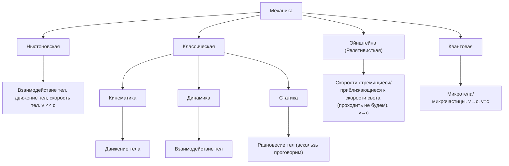

#Физика
# Механика
## Предисловие

<u>Пон. 1</u>
Механическое движение - простейшее взаимодействие тел или материальных объектов.
<u>Пон. 2</u>
Материя - всё, что нас окружает.

## Кинематика. Кинематика поступательного движения.

<u>опр. 1</u>
**Кинематика** - раздел классической механики, в котором изучается движение простых тел без исследования причин, вызывающих это движение. Отвечает на вопрос как? Как двигается тело?

Характеристики движения:

<u>опр. 2</u>
Тело отсчёта (Т.О.) - реальное (чаще всего) физическое тело, относительно которого рассматривается движение в данной задаче. Тело отсчёта соответствует мерности пространства.

<u>опр. 3</u>
Система отсчёта (С.О.) - это тело отсчёта + система координат  + какой-либо способ измерения промежутков времени ("часы")

<u>опр. 4</u>
Инерциальная система отсчёта (И. С. О.) - такая система отсчёта, относительно которой тела движутся равномерно и прямолинейно. Выдумал Лоренц и поддержал Ньютон. Для нас это поверхность земли.

<u>опр. 5</u>
Траектория - реальная или воображаемая линия (набор точек), вдоль которой движется тело. 

(•) Тело заменяется на модель, модель называется материальной точкой.

<u>опр. 6</u>
Материальная точка - простейшая модель тела, в которой мы пренебрегаем почти всеми свойствами.

(•) Во вращательном движение будет модель, которая называется абсолютно твёрдое тело.

<u>опр. 7</u>
Абсолютно твёрдое тело - тело, размеры и формы которого в процессе вращения не меняются. 

<u>опр. 8</u>
Радиус-вектор точки ( $\vec{r}$ ) - вектор, с помощью которого задают положение материальной точки в пространстве (один из способов задания положения мат. точ.). Это вектор проведённый из начала координат в данную точку.
рисунок 1

![[Учёба/Физика/Рисунки/рис. 1|рис. 1]]

<u>опр. 9</u>
Перемещение ( $\vec{S}$ ) - векторная физическая величина, численно равная вектору соединяющая начальную и конечную точки перемещения. 
$$\vec{S}=\vec{r_2}-\vec{r_1}$$

<u>опр. 10</u>
Путь ( $l$ ) - скалярная физическая величина, характеризующая движения и численно равная расстоянию, пройдённому материальная точкой вдоль траектории.  
$l\geq |\vec{S}|$
$\vec{S}>0$ - всегда, если тело двигалось
$l$ может быть $= 0$

<u>опр. 11</u>
Скорость (мгновенная скорость) ( $\vec{v}$ )- векторная физическая величина, характеризующая быстроту перемещения материальной точки вдоль траектории.

$$\vec{v} =\frac{d\vec{r}}{dt}=\frac{d\vec{S}}{dt}$$
$$\bigg(|\vec{v}|=\frac{dx}{dt}\bigg)$$
![[Учёба/Физика/Рисунки/рис. 2|рис. 2]]

<u>опр. 12</u>
Средняя скорость
$$\langle\vec{v}\rangle =\frac{\delta \vec{r}}{\delta t}\frac{\delta \vec{S}}{\delta t}$$
<u>опр. 13</u>
Средняя путевая скорость - скалярная физическая величина.
$$v_{ср} = \frac{l}{\Delta T}$$

<u>опр. 13</u>
Ускорение (мгновенное ускорение) ( $\vec{a}$ )- векторная физическая величина, характеризующая быстроту изменения скорости. 
$$\vec{a}=\frac{d\vec{v}}{dt}=\frac{d^2 \vec{r}}{(dt)^2}=\frac{d^2 \vec{S}}{(dt)^2}$$
<u>опр. 14</u>
Среднее ускорение - векторная физическая величина.
$$\langle\vec{a}\rangle=\frac{\Delta\vec{v}}{\Delta t}$$

<u>опр. 15</u>
Полное ускорение
Так как ускорение характеризует изменение скорости по модулю и направлению, то полное ускорение складывается из двух составляющих: $$\vec{a}=\vec{a_n}+\vec{a_{\tau}}$$<u>опр. 16</u>
$\vec{a_n}$ - нормальное ускорение (от слова нормаль) - характеризует быстроту изменения скорости по направлению и направлена к центру окружности или центру окружности в отрезке криволинейного движения. (В школе называлось центростремительным)
$$\vec{a_n} =\frac{v^2}{R}$$
$R$ - радиус окружности

$$\vec{a_n} =\frac{v^2}{r_{кр}}$$
$r_{кр}$ - радиус кривизны траектории (!!)

<u>опр. 17</u>
$\vec{a}_{\tau}$ - тангенциальное ускорение (от слова тангенс), ещё называется касательное, характеризует быстроту изменения скорости по модулю и направлена по касательной к траектории 
$$a_{\tau}=\frac{dv}{dt}$$

![[Учёба/Физика/Рисунки/рис. 3|рис. 3]]

(!!) Посмотреть материал по равномерном движению по окружности 
$|\vec{v}| = const$     $a_n \to a_ц$
Равномерное и равнопеременное движение (формулы и графики) самостоятельно посмотреть, так как предполагается, что мы это уже знаем из школы.

## Динамика. Динамика поступательного движения.

<u>опр. 1</u>
**Динамика** - раздел классической механики, в котором изучается причину или причины движение тел, независимо от вида движения. Отвечает на вопрос почему? Почему двигается тело? Наличие силы - причина движения.

<u>опр. 2</u>
Сила ( $\vec{F}$ )- векторная физическая величина, характеризующая взаимодействие тел, в результате которого тела деформируются или приобретают ускорение.

<u>Характеристики силы.</u>
1. Точка приложения
2. Направлением
3. Модулем

Динамика основана на трёх законах Ньютона.

I. Закон Ньютона
Провозглашает существование существование инерциальных систем отсчёта, в которых тело либо покоится, либо движется равномерно прямолинейно. 

<u>опр. 3</u>
Инертность - способность тела менять скорость не скачком, а постепенно.

II. Закон Ньютона